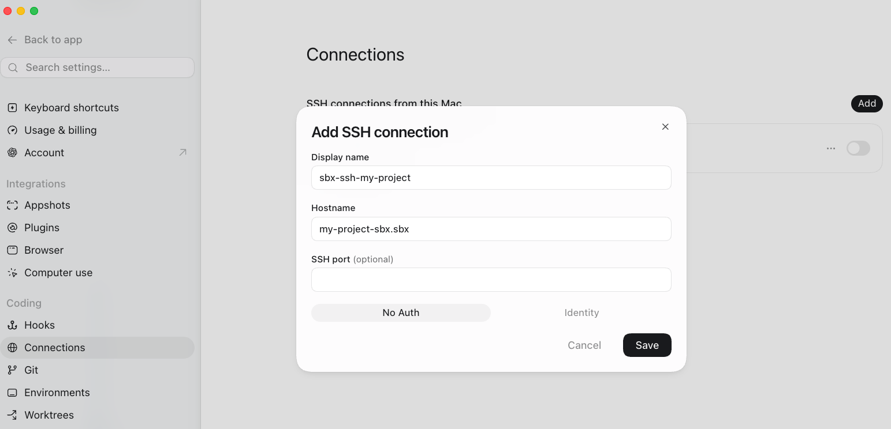
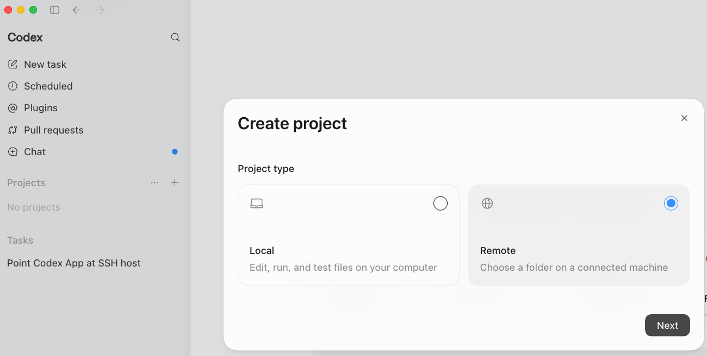
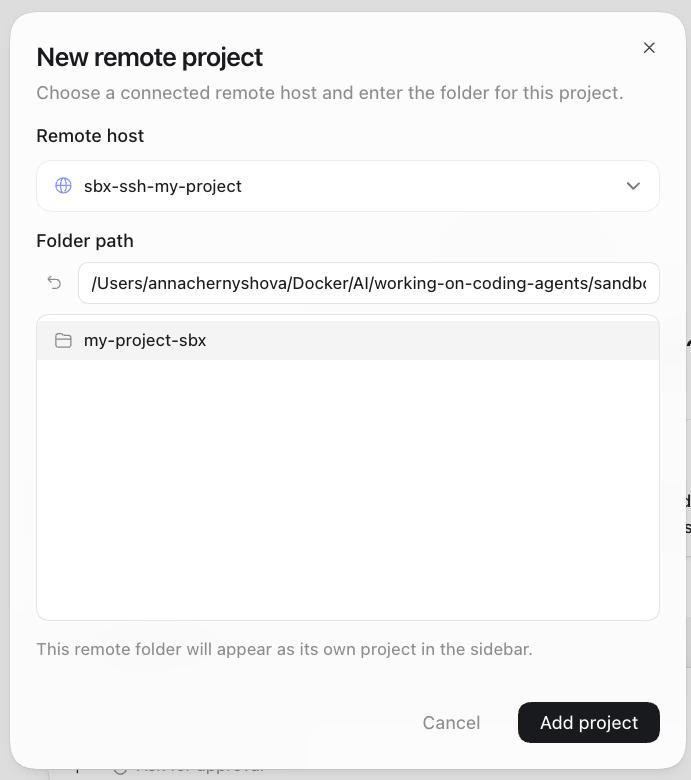

# Connecting the Codex UI to a sandbox

Connect the Codex desktop app to an `sbx` sandbox over SSH, so Codex runs against the
sandboxed workspace as a Remote Project.

> **One sandbox per project.** Before creating a Remote Project in Codex, start a dedicated
> sandbox for that project, add it as an SSH connection, then associate it with the project.

## Prerequisites

- `sbx` 0.35.0+

## One-time — authenticate with OpenAI (SSO)

Codex needs OpenAI credentials to run in the sandbox. Authenticate **once per machine** with your
OpenAI SSO account (global secret, shared by every sandbox):

```bash
sbx secret set -g openai --oauth
```

This opens a browser to complete SSO login. You only need to do this once; you don't repeat it per
project. (If Codex connects but nothing happens when you run a task, this step was skipped.)

## Step 1 — Create the sandbox

`sbx_ssh_setup.sh` / `sbx_ssh_setup.ps1` handles everything in one call: on first run it enables
the SSH feature (`platform.allowExperimentalFeatures`, `feature.ssh`), restarts the daemon, and
runs `sbx ssh setup` (once); on every run it creates the sandbox for the chosen agent.

From your project directory, run it with the `codex` agent:

```bash
cd <your-project>
./sbx_ssh_setup.sh codex        # Windows: .\sbx_ssh_setup.ps1 codex
```

The sandbox is named after the directory (sanitized to lowercase). The script verifies SSH
connectivity and prints the exact **Display name** and **Hostname** to paste into Codex in Step 2
(copying the hostname to your clipboard). You can also verify manually:

```bash
ssh <sandbox-name>.sbx
```

## Step 2 — Add the sandbox as an SSH connection in Codex

In Codex, open **Settings → Connections → Add → Add manually**, then configure:

- **Display name:** any friendly name
- **Hostname:** `<sandbox-name>.sbx`

Save the connection.



## Step 3 — Create a Remote Project

Create a new project and choose the **Remote** project type:



Select the SSH connection from Step 2 as the remote host, then pick the project directory inside
the sandbox — this is the same directory the sandbox was started from (mounted at the same path
inside the sandbox). Click **Add project**, then start coding.



## Working with multiple projects

Repeat the flow per project — one sandbox each:

```
Create project → Start a new sbx → Add SSH connection in Codex → Create Remote Project → Start coding
```

1. Navigate to the new project directory.
2. Start a new sandbox (`./sbx_ssh_setup.sh codex`).
3. Add the sandbox as a new SSH connection in Codex.
4. Create a new Remote Project using that connection.
