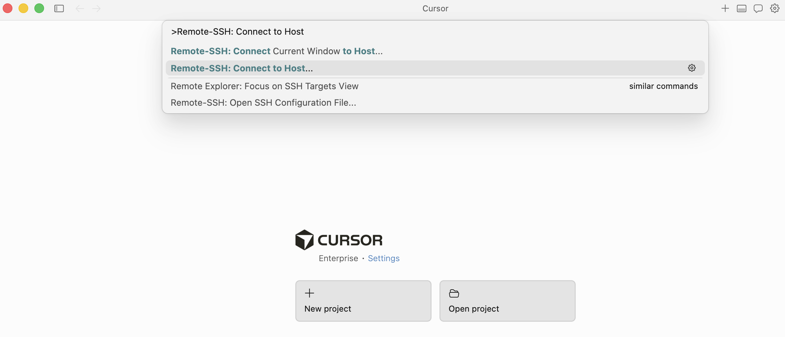
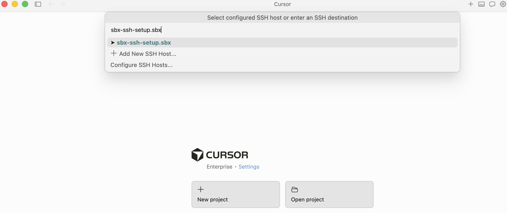
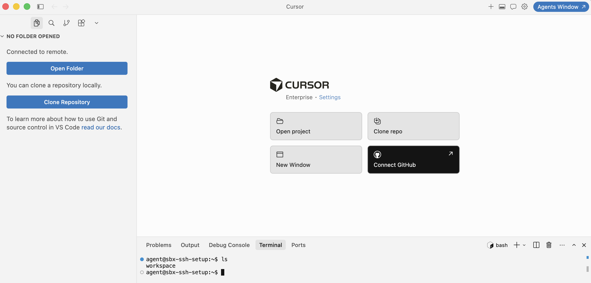

# Connecting Cursor to a sandbox

Connect the Cursor desktop app to an `sbx` sandbox over SSH, so Cursor runs against the
sandboxed workspace as a Remote-SSH window.

> **One sandbox per project.** Start a dedicated sandbox for the project, verify SSH
> connectivity, then connect Cursor to it and open the project folder inside the sandbox.

## Prerequisites

- `sbx` 0.35.0+
- [Cursor](https://cursor.com) installed, with the built-in **Remote-SSH** feature.

Cursor is a VS Code fork, so it connects through the managed `Host *.sbx` block that
`sbx ssh setup` writes to your `~/.ssh/config`. You never add a per-sandbox SSH entry by hand —
the wildcard covers every sandbox you create.

## Step 1 — Create the sandbox

`sbx_ssh_setup.sh` / `sbx_ssh_setup.ps1` handles everything in one call: on first run it enables
the SSH feature (`platform.allowExperimentalFeatures`, `feature.ssh`), restarts the daemon, and
runs `sbx ssh setup` (once); on every run it creates the sandbox for the chosen agent.

From your project directory, run it with the `cursor` agent:

```bash
cd <your-project>
./sbx_ssh_setup.sh cursor        # Windows: .\sbx_ssh_setup.ps1 cursor
```

The sandbox is named after the directory (sanitized to lowercase). The script verifies SSH
connectivity. The hostname is the sandbox name plus `.sbx` — verify it manually anytime:

```bash
ssh <sandbox-name>.sbx
```

If that drops you into a shell inside the sandbox, you are ready. Type `exit` to return.

## Step 2 — Connect Cursor over Remote-SSH

Open the Command Palette (`Cmd+Shift+P`) and run **Remote-SSH: Connect to Host…**.



In the host picker, **type the full sandbox hostname** — `<sandbox-name>.sbx` — and select it.
The wildcard `*.sbx` rule is not listed as its own item, so you type the concrete name.



Cursor opens a new window and, on first connect, installs its remote server into the sandbox
(~30–60s). Choose **Linux** if prompted for the platform.

## Step 3 — Open the project folder

Once the status bar shows **Connected to remote**, click **Open Folder** and choose the project
directory inside the sandbox — the same directory the sandbox was started from (mounted at the same
path inside the sandbox). The integrated terminal runs inside the sandbox; the prompt shows
`agent@<sandbox-name>:~$`.



You can now edit, run, and use Cursor's AI features against the code inside the sandbox.

## Working with multiple projects

Repeat the flow per project — one sandbox each:

```
Create project → Start a new sbx → Remote-SSH: Connect to Host → Open the project folder → Start coding
```

1. Navigate to the new project directory.
2. Start a new sandbox (`./sbx_ssh_setup.sh cursor`).
3. In Cursor, **Remote-SSH: Connect to Host…** → `<sandbox-name>.sbx`.
4. Open the project folder inside that sandbox.

## Troubleshooting

- **Connect hangs on "Downloading/Installing server".** Cursor downloads its remote server from
  *inside* the sandbox, which has a default-deny outbound firewall. Check what was blocked and
  allow Cursor's domains on your host:
  ```bash
  sbx policy log
  sbx policy allow network cursor.sh,cursor.com,download.cursor.sh
  ```
- **Host key changed after recreating a sandbox.** The managed `*.sbx` block uses
  `StrictHostKeyChecking yes`, so a changed host key hard-fails. Re-run `sbx ssh setup` to refresh
  the managed `known_hosts`.
- **`ssh <sandbox-name>.sbx` fails from the terminal.** Fix this first — if plain `ssh` cannot
  reach the sandbox, Cursor cannot either. Confirm the sandbox is running with `./sbx_list.sh`.
</content>
